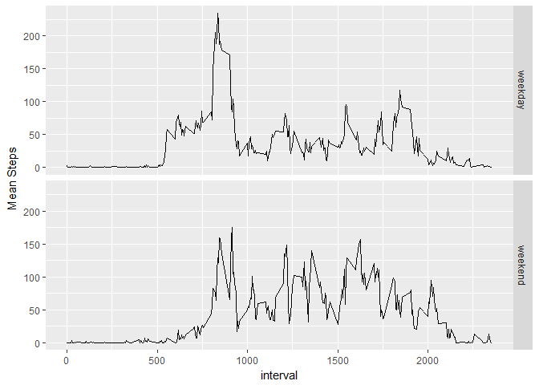
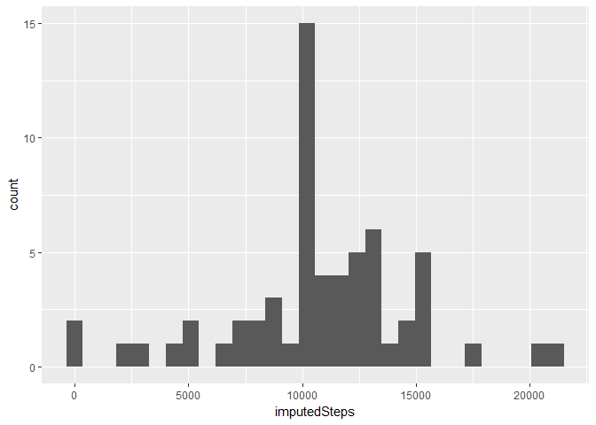
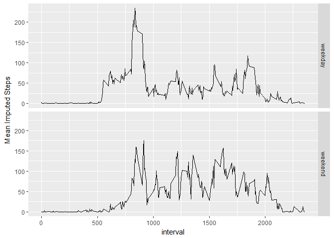

# Course5 Reproducible Research Project1
Jiangbin Yang  
September 2, 2017  


This project makes use of data from a personal activity monitoring device. This device collects data at 5 minute intervals through out the day. The data consists of two months of data from an anonymous individual collected during the months of October and November, 2012 and include the number of steps taken in 5 minute intervals each day.

The variables included in this dataset are:

- steps: Number of steps taking in a 5-minute interval (missing values are coded as NA)
- date: The date on which the measurement was taken in YYYY-MM-DD format
- interval: Identifier for the 5-minute interval in which measurement was taken

## Loading and preprocessing the data

Before loading the data, some preparation work:

```r
library(ggplot2)
```

Now load and pre-process the data:

0. Download the data file from the Internet
1. Load the data using read.csv()
2. Process and transform the data into a format suitable for the analysis


```r
if(!file.exists("./activity.csv")) {
  weblink <- "https://d396qusza40orc.cloudfront.net/repdata%2Fdata%2Factivity.zip"
  download.file(weblink, "repdata_data_activity.zip")
  unzip("repdata_data_activity.zip")  # extract to "activity.csv"
}

activityDF<- read.csv("activity.csv")

activityDF$DOW <- weekdays(as.Date(activityDF$date), abbreviate = TRUE)
activityDF$weekdayInd <- "weekday"
activityDF[activityDF$DOW %in% c("Sat", "Sun"), "weekdayInd"] <- "weekend"
activityDF <- transform(activityDF, weekdayInd = as.factor(weekdayInd))
```

## What is mean total number of steps taken per day?

There are missing values on the variable steps in the data. In this section, the missing values will be ignored. 

The code in this section performs:

1. Calculate the total number of steps taken per day
2. Make a histogram of the total number of steps taken each day
3. Calculate and report the mean and median of the total number of steps taken per day


```r
actDaily <- aggregate(steps ~ date, data=activityDF, sum)
qplot(steps, data = actDaily, bins = 30)
```

<!-- -->

```r
mean(actDaily$steps)
```

```
## [1] 10766.19
```

```r
median(actDaily$steps)
```

```
## [1] 10765
```

## What is the average daily activity pattern?

The code in this section performs:

1. Make a time series plot (i.e. type = "l") of the 5-minute interval (x-axis) and the average number of steps taken, averaged across all days (y-axis)
2. Calculate which 5-minute interval, on average across all the days in the dataset, contains the maximum number of steps?


```r
actInterval <- aggregate(steps ~ interval, data = activityDF, mean)
qplot(interval, steps, data = actInterval, geom = "line")
```

<!-- -->

```r
maxInterval <- actInterval$interval[which.max(actInterval$steps)]
maxInterval
```

```
## [1] 835
```

The 5-minute interval of 835, on average across all the days in the dataset, contains the maximum number of steps. 

## Imputing missing values

The presence of missing days may introduce bias into some calculations or summaries of the data. All the missing values are on the steps variable. A **strategy** of imputing the missing values is to use the mean steps for each 5-minute interval to fill in. There is difference between weekdays and weekends in the 5-minute interval mean steps pattern, see the panel plot below. *Therefore, we use the the 5-minute interval mean steps per weekday or weekend to impute the missing steps values, depends on which 5-minute interval and whether it is in a weekday or weekend.* 

The code in this section performs: 

1. Calculate and report the total number of missing values in the dataset (i.e. the total number of rows with NAs.) 
2. Exam the 5-minute interval mean steps pattern between weekdays and weekends, to devise a strategy for filling in all of the missing values in the dataset. 
3. Create a new dataset that is equal to the original dataset but with the missing data filled in.
4. Make a histogram of the total number of steps taken each day and 
5. Calculate and report the mean and median total number of steps taken per day. 


```r
# total number of records with missing values:
sum(rowSums(is.na(activityDF)) > 0)
```

```
## [1] 2304
```

```r
# total number of missing values of steps:
sum(is.na(activityDF$steps))
```

```
## [1] 2304
```

```r
# exam the 5-minute interval mean steps pattern between weekdays and weekends:
actInterval2 <- aggregate(steps ~ weekdayInd + interval, data = activityDF, mean)
names(actInterval2)[3] <- "meanSteps"
qplot(interval, meanSteps, data = actInterval2, geom = "line", 
      ylab = "Mean Steps", facets = weekdayInd ~ .)
```

<!-- -->

```r
# impute using mean steps value per 5-minute interval and per weekday or weekend: 
actImpute <- merge(activityDF, actInterval2, by = c("weekdayInd", "interval"))
actImpute <- transform(actImpute, imputedSteps = ifelse(is.na(steps), meanSteps, steps))
# the final imputed dataset:
actImputed <- actImpute[order(actImpute$date, actImpute$interval),]
rm(actImpute)

actImpDaily <- aggregate(imputedSteps ~ date, data = actImputed, sum)
qplot(imputedSteps, data = actImpDaily, bins = 30)
```

<!-- -->

```r
mean(actImpDaily$imputedSteps)
```

```
## [1] 10762.05
```

```r
median(actImpDaily$imputedSteps)
```

```
## [1] 10571
```

The impact of imputing missing data: The mean and median total numbers of steps are slightly smaller than the estimates from the first part of the analysis without imputattion. This is probably because the missing values were mostly for the 5-minute intervals where the activity was low (i.e., the steps values were small.)

## Are there differences in activity patterns between weekdays and weekends?

The imputed dataset is used for analysis in this section.

A new factor variable, weekdayInd, with two levels - "weekday" and "weekend" indicating whether a given date is a weekday or weekend day, has already been created in the previous data pre-processing part.

The following code makes a panel plot containing a time series plot (i.e. type = "l") of the 5-minute interval (x-axis) and the average number of steps taken, averaged across all weekday days or weekend days (y-axis). 


```r
actImpInterval2 <- aggregate(imputedSteps ~ weekdayInd + interval, data = actImputed, mean)
qplot(interval, imputedSteps, data = actImpInterval2, geom = "line", 
      ylab = "Mean Imputed Steps", facets = weekdayInd ~ .)
```

<!-- -->

Note that this panel plot appears the same as the plot using the un-imputed raw data. This is true, because the missing steps values have been imputed by the same mean values.

There is difference between weekdays and weekends in the 5-minute interval mean steps pattern. Between the 550 and 900 5-minute intervals, there were more activity during weekdays than weekends. However, between the 900 and 2150 5-minute intervals, it is the reverse: there were more activity during weekends than weekdays.
